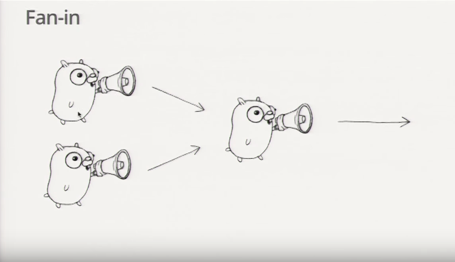
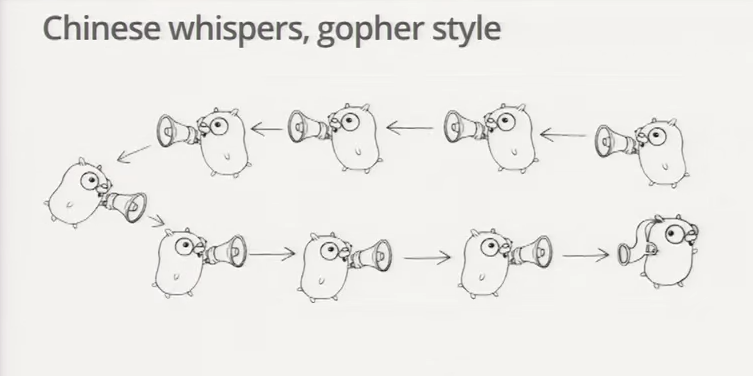

# **Go Concurrency Patterns** ~ Rob Pike

[Google I/O 2012 - Rob Pike ~ YouTube](https://youtu.be/f6kdp27TYZs)

[HTML5 Slide Presentation ~ with runnable code](https://talks.golang.org/2012/concurrency.slide#1)

<br>

More examples:

* [gochatroulette ~ video](http://tinyurl.com/gochatroulette)
* [goloadbalancer](http://tinyurl.com/goloadbalancer)
* [goseive](http://tinyurl.com/goseive)
* [gopowerseries](http://tinyurl.com/gopowerseries)


## Generator: function that returns a channel
<hr>

Performs a synchronized lockstep of "services"

```go
 c := boring("boring!") // Function returning a channel
 for i := 0; i < 5; i++ {
   fmt.Println("You say: %q\n", <-c)
 }
 fmt.Println("You're boring: I'm leaving.")
```

```go
func boring(msg string) <-chan string { // Returns receive-only channel of strinthis implemented? How is it structured?

* A search function can be simulated, much like the simulated conversation before:

```go
var (
  Web = fakeSearch("web")
  Image = fakeSearch("image")
  Video = fakeSearch("video")
)
gs
  c := make(chan string)
  go func() {
    for i := 0; i++ {
      c <- fmt.Sprintf("%s %d, msg, i)
      time.Sleep(time.Duration(rand.Intn(1e3)) * time.Millisecond)
    }
  }()
  return c // Return the channel to the caller
}
```

* is a function that returns a channel object
* boring function has a return value of `<-chan string`
  * it is a "receiver only" channel of string
    * the `main` function is only going to use it to receive a value 
      over the channel

<br>


## Multiplexing: "fan-in" avoids lockstepping
<hr>

To avoid lockstepping (see joe and ann above)

<!--  -->


```go
func fanIn(input1, input2 <-chan string) <-chan string {
  c := make(chan string)
  go func() { for { c <- <-input1 } }()
  go func() { for { c <- <-input2 } }()
  return c
}

func main() {
  c := fanIn(boring("Joe"), boring("Ann))
  for i := 0; i < 10; i++ {
    fmt.Println(<-c)
  }
  fmt.Println("You're both boring; I'm leaving.")
}
```

* the calls to the `boring` func are stitched together by the `fanIn` func which returns to a single channel variable of `<-chan string` .."c"
* `fanIn` is still using the generator pattern
  * it is itself a func that takes two inputs of a channel and outputs a channel
* it copies the value from `<-input1` to the `c` channel and copies the value of `<-input2` to the `c` channel
* when it runs "Ann" and "Joe" are completely independent


<br>


## Restoring Sequencing
<hr>

* Send a channel on a channel, making goroutine wait its turn
* Receive all messages, then enable them again by sending on a private channel
* First, define a message type that contains a channel for the reply

  ```go
  type Message struct {
    str string
    wait chan bool
  }
  ```

* Because channels are first class values in go, a channel can be sent over a channel
* uses a `wait` channel in the `Message` struct
  * `wait chan bool`
  * is like a "signaler"
  * will block until the user says otherwise

* Each "speaker" must wait for a "go-ahead"
  ```go
  for i := 0; i < 5; i++ {
    msg1 := <-c; fmt.Println(msg1.str)
    msg2 := <-c; fmt.Println(msg2.str)
    msg1.wait <- true
    msg2.wait <-true
  }
  ```
  ```go
  waitForIt := make(chan bool) // Shared between all messages
  ```
  ```go
        c <- Message{ fmt.Sprintf("%s: %d", msg, i), waitForIt }
        time.Sleep(time.Duration(rand.Intn(2e3)) * time.Millisecond)
        <-waitForIt
  ```
<br>


## Select
<hr>

* A control structure that allows control the behavior of the program based on what communications are able to proceed on any given moment
* Unique to concurrency
* The reason channels and goroutines are built into the language
* Provides another way to handle multiple channels
* Like a switch, but each case is a communication
  * All channel are evaluated
  * `select` blocks until one communication can proceed, which then does
  * If multiple can proceed simultaneously, select chooses pseudo-randomly
    * NOTE: this may be problem if sequential determinism is depended upon.. BE AWARE
  * A `default` case, if present, executes immediately if no channel is ready
    * prevents blocking communication

```go
select {
  case v1 := <-c1:
    fmt.Println("received %v from c1\n", v1)
  case v2 := <-c2:
    fmt.Println("received %v from c2\n", v2)
  case c3 <- 23:
    fmt.Printf("sent %v to c3\n", 23)
  default:
    fmt.Println("no one was ready to communicate\n")
}
```

<br>

## Fan-in Using Select
<hr>

* Rewrite of original fan-in function
  * only one goroutine is needed
  * still uses the generator pattern

**Old:**
```go
func fanIn(input1, input2 <-chan string) <-chan string {
  c := make(chan string)
  go func() { for { c <- <-input1 } }()
  go func() { for { c <- <-input2 } }()
  return c
}
```

**New:**
```go
func fanIn(input1, input2 <-chan string) <-chan string {
  c := make(chan string)
  go func() {
    for {
      select {
        case s := <-input1: c <- s
        case s := <-input2: c <- s
      }
    }
  }
}
```

<br>

## Timeout Using Select
<hr>

* The time.After function returns a channel that blocks for the specified duration
* After the interval, the chanel delivers the current time, once
* "Either Joe returns a value within the allotted time, or return
```go
func main() {
  c := boring("Joe")
  for {
    select {
      case s := <-c:
        fmt.Println(s)
      case <-time.After(1 * time.Second):
        fmt.Println("You're too slow.")
        return
    }
  }
}
```

<br>


## Timeout For Whole Conversion Using Select
<hr>

* Create the timer once, outside the loop, to time-out the entire conversation
  * the entire for-loop timesout in the example below
  * The previous pattern, there was a timeout for each message
```go
func main() {
  c := boring("Joe")
  timeout := time.After(5 * time.Second)
  for {
    select {
      case s := <-c:
        fmt.Println(s)
      case <-timeout:
        fmt.Println("You talk too much.")
        return
    }
  }
}
```

<br>


## Quit Channel
<hr>

* To deterministically time-out
* User ends the function at a certain point in execution
* But, there is a problem with this pattern.. the sender may need to do something before ending.. like some kind of clean up, etc. (see next pattern that addresses this use-case)
```go
quit := make(chan bool)
c := boring("Joe", quit)
for i := rand.Intn(10); i >= 0; i-- { fmt.Println(<-c) }
quit <-true
```
```go
    select {
      case c <- fmt.Sprintf("%s: %d", msg, i):
          // do nothing
      case <-quit:
        return
    }
```

<br>

## Receive on Quit Channel
<hr>

* Addresses the problem labled in the previous pattern
* The sender notifies the receiver when it is done
  * Receive on the "quit" channel
  * `quit` channel is a roundtrip communication

```go
quit := make(chan string)
c := boring("Joe", quit)
for i := rand.Intn(10); i >= 0; i-- { fmt.Println(<-c) }
quit <- "Bye!"
fmt.Printf("Joe says: %q\n, <-quit)
```
```go
      select {
        case c <- fmt.Sprintf("%s: %d", msg, i):
            // do nothing
        case <-quit:
          cleanup()
          quit <- "See you!"
          return
      }
```

<br>


## Daisy-chain
<hr>



```go
func f(left, right chan int) {
  left <- 1 + <-right
}

func main() {
  const n = 100000
  leftmost := make(chan int)
  right := leftmost
  left := leftmost
  for i := 0; i < n; i++ {
    right = make(chan, int)
    go f(left, right)
    left = right
  }
  go func(c chan int) { c <- 1 }(right)
  fmt.Println(<-leftmost)
}
```

<br>


## Systems Software
<hr>

* Go was designed for systems software.
* Here is shown where concurrency features can be applied

* Example: Google Search Engine

  Q: What does Google search do?

  A: Given a query, return a page of search results 

  Q: How does one get the search results

  A: Send the query to Web search, Image search, Ads, Youtube, Maps, News, etc., then mix the results

  How is this implemented? How is it structured?

* A search function can be simulated, much like the simulated conversation before:

```go
var (
  Web = fakeSearch("web")
  Image = fakeSearch("image")
  Video = fakeSearch("video")
)

type Search func(query string) Result

func fakeSearch(kind string) Search {
  return func(query string) Result {
    time.Sleep(time.Duration(rand.Intn(100)) * time.Millisecond)
    return Result(fmt.Sprintf("%s result for %q\n", kind, query))
  }
}
```


